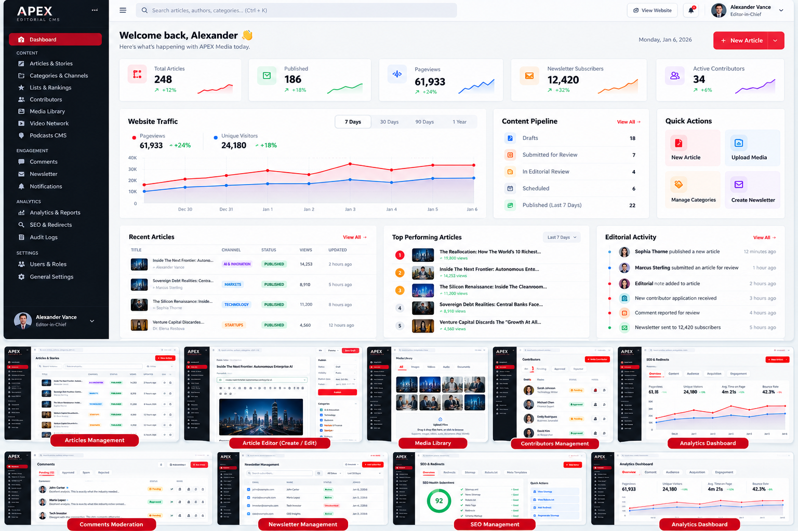

# APEX International Business & Leadership

# 0. VISUAL DESIGN REFERENCE

The following generated concept image is the visual direction for this redesign.

Use this image as a **design direction and visual reference**, not as an exact pixel-for-pixel implementation.

The final implementation should preserve the existing APEX brand and real application data while achieving the same level of:
- professional editorial hierarchy
- compact navigation
- clean whitespace
- premium dashboard composition
- analytics visualization
- editorial workflow visibility
- article-management density
- consistent component design
- responsive behavior

IMPORTANT:
- Do not replace real application data with values from the concept image.
- Do not hard-code the example names, metrics, articles, avatars, or dates from the image.
- Use the existing database and application data.
- Treat all values shown in the reference as visual examples only.
- Keep APEX branding original and do not copy Forbes proprietary design or assets.

# Antigravity Prompt — Professional Editorial CMS Admin UI/UX Redesign

## ROLE

Act as a senior SaaS product designer, UX architect, and Laravel frontend engineer.

You are redesigning the existing APEX International Business & Leadership editorial CMS/admin panel at:

`C:\NewsBlog`

The current admin dashboard is functional but visually rough, dated, poorly balanced, and does not look like a professional digital publishing platform.

The attached screenshot is the current UI reference. Use it as the baseline for what must be improved, but DO NOT preserve its visual structure when that structure is causing the problems described below.

The goal is to create a polished, premium editorial CMS experience inspired by the usability and information architecture of major professional publishing platforms such as Forbes-style business media, Bloomberg-style editorial systems, modern SaaS dashboards, and enterprise newsroom tools.

IMPORTANT:
- Do not copy Forbes branding, proprietary UI, code, text, images, or exact layouts.
- APEX must remain its own original brand.
- Preserve all existing functionality, routes, database records, permissions, article data, media, SEO functionality, and workflows unless a change is explicitly required for the redesign.
- This is a UI/UX redesign and admin experience upgrade, NOT a rebuild of the application.
- First inspect the existing Laravel application and reuse existing components/data wherever possible.

---

# 1. CURRENT PROBLEMS TO FIX

The current dashboard has these major problems:

1. The left sidebar is too visually heavy.
2. The black sidebar consumes too much horizontal space.
3. Navigation items are oversized and visually repetitive.
4. There is excessive empty space in some areas but crowding in others.
5. Dashboard cards look like basic template cards rather than a professional newsroom interface.
6. Typography hierarchy is weak.
7. There is no strong top-level command/header area.
8. Dashboard metrics do not communicate trends or changes.
9. The page feels like an admin template rather than a real editorial operations center.
10. Recent articles and Most Read sections are too plain.
11. There is no meaningful data visualization.
12. No clear distinction between editorial workflow, audience analytics, and publishing actions.
13. The sidebar does not feel intelligently grouped.
14. There is no compact global search/command experience.
15. No notification/activity center is visually prominent.
16. Quick actions are too limited.
17. The interface does not feel premium enough for an international business publication.
18. Responsive behavior needs to be professionally designed.
19. The current active state is too large and visually dominant.
20. The dashboard should provide a much better "newsroom at a glance" experience.

---

# 2. DESIGN DIRECTION

Create a premium editorial SaaS interface with:

- Clean white/light-gray workspace
- APEX brand identity
- Strong black/dark typography
- Controlled red accent color based on APEX branding
- Very subtle borders
- Soft neutral backgrounds
- Minimal shadows
- Compact but comfortable spacing
- Professional data visualization
- Editorial/newsroom terminology
- Strong information hierarchy
- High-density but readable tables
- Modern pills/status badges
- Excellent hover/focus states
- Consistent 8px spacing system
- 12-column responsive grid
- 1440px+ desktop optimization
- Tablet support
- Mobile support

Do NOT make the UI overly rounded, colorful, childish, or generic.

Avoid:
- excessive glassmorphism
- giant cards
- excessive gradients
- excessive shadows
- giant icons
- oversized navigation
- dashboard-template clichés
- unnecessary animations

The interface should feel like a serious global business publication's internal newsroom.

---

# 3. GLOBAL ADMIN SHELL

Redesign the entire admin shell, not only the dashboard.

## Desktop structure

Use:

### Left navigation
Width approximately 230–250px.

It should be compact and elegant.

Top:

APEX logo/wordmark
Editorial CMS subtitle

Then navigation grouped into sections.

Example:

WORKSPACE
- Dashboard
- Articles
- Editorial Queue
- Media Library

PUBLISHING
- Categories
- Rankings & Lists
- Authors & Contributors
- Videos
- Podcasts

AUDIENCE
- Comments
- Newsletters
- Subscribers
- Notifications

GROWTH
- Analytics
- SEO & Redirects
- Audience Insights

SYSTEM
- Audit Logs
- Settings

Use subtle section labels.

Do not make every navigation item look like a giant button.

The active navigation item should have:
- subtle red background or red left indicator
- strong text
- compact height
- small icon
- excellent contrast

Allow sidebar collapse.

Collapsed mode:
- icons only
- tooltips
- smooth transition

## Sidebar footer

Include:
- current admin avatar
- name
- role
- online/status indicator
- small account/settings menu
- logout

Do not consume excessive vertical space.

---

# 4. TOP HEADER

Create a professional top bar.

Left:
- page title
- optional breadcrumb

Center or flexible:
- global search / command search

Right:
- quick create button
- notifications
- activity
- profile menu

Example:

Dashboard

[ Search articles, authors, topics...   Ctrl K ]

[ + Create ] [ Bell ] [ Avatar ]

The header must remain clean and compact.

---

# 5. DASHBOARD REDESIGN

Replace the current dashboard composition with a proper editorial operations dashboard.

## Header area

At the top:

Dashboard
Editorial overview and newsroom performance

Right:

[ + New Article ]
[ More ]

Under it optionally show:

Today · Last 7 days · Last 30 days

with a compact date/filter control.

---

# 6. KPI ROW

Create 4–5 premium KPI cards.

Recommended:

### Published Stories
Value:
6

Supporting information:
+12% vs previous period

Small trend sparkline.

### Pageviews
Value:
61,933

Supporting:
+18.4%

Sparkline.

### Active Readers
Value:
Live/current readers

Supporting:
currently online

### Newsletter Subscribers
Value:
0

Supporting:
+0 this week

### Editorial Pipeline
Value:
Drafts / Review / Scheduled

Supporting:
workflow status

Do not use oversized boxes.

Each KPI should have:
- label
- large number
- comparison
- tiny sparkline
- subtle icon
- optional status indicator

If actual analytics data exists, use it.
Do not fabricate data.

If a metric is unavailable, display:
"Data unavailable"
rather than fake values.

---

# 7. MAIN ANALYTICS AREA

Create a two-column layout.

Left approximately 65–70%.

## Audience & Traffic Overview

Use a professional line/area chart.

Controls:
- 7D
- 30D
- 90D
- 12M

Metrics:
- Pageviews
- Unique readers
- Sessions

Use APEX red as the primary chart accent.

Do not over-style the graph.

Include:
- tooltip
- legend
- comparison period when data exists

Right approximately 30–35%.

## Editorial Pipeline

Display:

Draft
12

In Review
5

Scheduled
8

Published Today
6

Rejected/Needs Changes
2

Each row should be clickable.

Use subtle progress indicators.

---

# 8. RECENT EDITORIAL CONTENT

Replace the current large basic table with a professional editorial table.

Columns:

Article
Author
Section
Status
Published
Views
Actions

Article cell should include:

thumbnail
headline
short metadata

Example:

[image] The Silicon Renaissance...
Sophia Thorne · Technology

Status badges:

Draft
In Review
Scheduled
Published
Archived

Use compact table rows.

Actions:

Edit
Preview
More

Do not use giant row heights.

Add:

[ View all articles ]

---

# 9. MOST READ

Create a clean ranking module.

Each item:

01
Headline
Category
Views
Trend indicator

Example:

01 The Reallocation...
19,800 views
↑ 18%

02 Inside the Next Frontier...
14,253 views
↑ 11%

03 The Silicon Renaissance...
11,200 views

Make the ranking visually elegant but compact.

---

# 10. EDITORIAL ACTIVITY

Add a newsroom activity feed.

Examples:

Alexander Vance published an article
8 minutes ago

Sophia Thorne submitted a story for review
21 minutes ago

Marcus Sterling updated SEO metadata
34 minutes ago

Editor approved "AI & Enterprise..."
1 hour ago

Use:
avatar
action
content
timestamp

This should make the CMS feel alive.

---

# 11. QUICK ACTIONS

Create a compact Quick Actions module.

Actions:

+ New Article
Upload Media
Create Ranking
Add Author
Create Newsletter
Schedule Story

Each action should have a small icon and concise label.

---

# 12. EDITORIAL CALENDAR

Add a compact upcoming publishing schedule.

Example:

TODAY
10:00 AM
AI & Innovation — "..."

2:30 PM
Markets — "..."

5:00 PM
Leadership — "..."

TOMORROW
9:00 AM
Technology — "..."

Allow clicking an item to open/edit the article.

---

# 13. CONTENT PERFORMANCE

Add a section showing top-performing content.

Metrics:

- Pageviews
- Average reading time
- Engagement
- Shares
- Newsletter conversions

Use a compact table or horizontal visualization.

Do not create fake metrics if these are not stored.

---

# 14. NEWSROOM STATUS

Add a small system health area.

Show:

Database
Healthy

Queue
Healthy

Cache
Healthy

Search
Healthy

Media Storage
Healthy

If the application already exposes health information, connect to it.

Otherwise do not invent fake health checks.

---

# 15. ARTICLE MANAGEMENT PAGE

Redesign `/admin/articles`.

The page should feel like a professional newsroom content management system.

Top:

Articles

[ Search ] [ Filters ] [ + New Article ]

Filters:

All
Draft
In Review
Scheduled
Published
Archived

Additional filters:

Category
Author
Date
Editor
Content type

Table:

Select
Article
Author
Category
Status
Updated
Published
Views
Actions

Add bulk actions:

Publish
Archive
Delete
Assign Editor
Change Category

Use confirmation dialogs for destructive actions.

---

# 16. ARTICLE EDITOR UX

The article editor must be significantly improved.

Use a modern two-column editorial workspace.

Main content column:
- headline
- deck/subheadline
- rich text editor
- media blocks
- quotes
- pull quotes
- embeds
- related stories
- tags

Right inspector:
- publishing status
- category
- author
- cover image
- SEO
- social preview
- canonical URL
- sponsored content
- featured flags
- breaking news
- trending
- editors pick
- publish date
- schedule

Add sticky Save / Preview / Publish controls.

Top action bar:

Save Draft
Preview
Submit for Review
Publish

Show autosave status.

Example:

Saved 12 seconds ago

---

# 17. MEDIA LIBRARY UX

Redesign `/admin/media`.

Provide:

- grid/list toggle
- search
- type filter
- uploader
- date filter
- tags
- dimensions
- file size
- usage count

Grid cards should show:

thumbnail
filename
type
dimensions
used in X articles

Clicking media opens a professional detail drawer.

---

# 18. AUTHORS & CONTRIBUTORS

Create a professional directory.

Cards/table should show:

Avatar
Name
Role
Articles
Views
Status
Last Active

Actions:

View
Edit
Suspend
Promote

Contributor workflow should be visually clear.

---

# 19. NEWSLETTERS

Create a better newsletter dashboard.

Show:

Subscribers
Active
Unsubscribed
Growth

Campaigns:

Draft
Scheduled
Sent

Include:

Create Campaign
Audience
Template
Schedule
Analytics

Campaign analytics:

Delivered
Opened
Clicked
Unsubscribed

Use real stored values only.

---

# 20. COMMENTS & MODERATION

Create a moderation command center.

Tabs:

All
Pending
Reported
Flagged
Approved
Spam

Each comment should show:

Avatar
User
Article
Comment preview
Time
Status
Report count
Actions

Actions:

Approve
Reject
Hide
Delete
Ban User

Make moderation fast and keyboard-friendly.

---

# 21. SEO & REDIRECTS

Create a professional SEO control center.

Dashboard metrics:

Indexed pages
Missing metadata
Duplicate titles
Missing descriptions
Broken links
Redirects

Tools:

SEO Audit
Redirect Manager
Sitemap
Robots.txt
Canonical URLs

Use status indicators.

---

# 22. ANALYTICS

Create an admin analytics area with:

Traffic
Content Performance
Audience
Authors
Categories
Newsletter
Search
Referrals

Charts:

Pageviews
Unique visitors
Reading time
Top stories
Traffic sources
Device split
Geography if legally/technically available

Do not fabricate analytics.

---

# 23. SEARCH / COMMAND PALETTE

Implement a global command/search experience.

Shortcut:

Ctrl + K

Search:

Articles
Authors
Categories
Media
Comments
Settings

Quick actions:

Create Article
Upload Media
Open Analytics
Open SEO
Open Newsletter

Use keyboard navigation.

---

# 24. NOTIFICATIONS

Create a compact notification center.

Examples:

Article submitted for review
Comment reported
Newsletter completed
Contributor application received
Scheduled article published

Unread count should be visible.

---

# 25. RESPONSIVE DESIGN

Desktop:
- full sidebar
- two-column dashboard
- dense tables

Tablet:
- collapsible sidebar
- simplified cards
- horizontal scrolling where appropriate

Mobile:
- sidebar becomes drawer
- cards stack
- tables become cards or responsive lists
- sticky bottom/compact actions where appropriate

Never allow:
- horizontal page overflow
- clipped buttons
- unreadable tables
- overlapping content

---

# 26. VISUAL SYSTEM

## Colors

Use APEX identity.

Primary:
- near-black
- white
- neutral gray
- APEX red accent

Use red strategically for:
- primary action
- active navigation
- important editorial alerts
- selected states

Do not make the entire UI red.

## Typography

Use a premium modern sans-serif for admin UI.

Suggested:
Inter
or another high-quality system/UI font already available in the project.

Hierarchy:

Page title:
28–32px

Section title:
16–20px

Body:
14–15px

Metadata:
12–13px

Numbers:
28–36px

Do not use giant typography.

## Radius

Use restrained radius:
6–10px.

Avoid excessive pill-shaped UI.

## Borders

Use subtle 1px borders.

Avoid heavy outlines.

## Shadows

Use minimal shadows only where useful.

---

# 27. ICON SYSTEM

Use one consistent icon library throughout the admin.

Prefer:
Lucide
Heroicons
or the icon system already used by the project.

Do not mix multiple icon styles.

Icons should generally be:
16–18px.

---

# 28. MICROINTERACTIONS

Add subtle professional interactions:

- hover state
- active state
- loading state
- skeleton loading
- save confirmation
- toast notifications
- dropdown animation
- sidebar collapse transition
- modal transition

Keep animations fast and subtle.

No excessive motion.

---

# 29. EMPTY STATES

Every module must have professional empty states.

Example:

No newsletter campaigns yet

Create your first campaign to start reaching your audience.

[ Create Campaign ]

Do not show blank white boxes.

---

# 30. ERROR STATES

Design:

- validation errors
- permission denied
- failed upload
- network error
- unavailable analytics
- failed save

Use clear actionable messages.

---

# 31. ACCESSIBILITY

Implement:

- WCAG-conscious contrast
- keyboard navigation
- visible focus states
- aria labels
- semantic buttons
- accessible dropdowns
- accessible modals
- screen-reader-friendly status indicators

Do not rely only on color to communicate status.

---

# 32. PERFORMANCE

The redesign must not make the admin slow.

Requirements:

- reuse existing backend queries
- avoid N+1 queries
- paginate large tables
- lazy load heavy media
- lazy load charts when appropriate
- optimize images
- minimize JavaScript
- reuse components
- avoid unnecessary API calls

---

# 33. IMPORTANT IMPLEMENTATION RULES

Before changing code:

1. Inspect the entire existing admin architecture.
2. Inspect routes.
3. Inspect controllers.
4. Inspect Blade templates/components.
5. Inspect CSS.
6. Inspect JS.
7. Inspect database relationships.
8. Inspect existing analytics implementation.
9. Inspect existing authentication/permissions.
10. Inspect existing admin functionality.

Then redesign using the existing architecture.

Do not create duplicate controllers or duplicate functionality.

Do not create duplicate routes.

Do not delete existing data.

Do not rename database columns unless absolutely necessary.

Do not break existing public URLs.

Do not break SEO URLs.

Do not remove existing article functionality.

Do not remove existing Phase 1 or Phase 2 functionality.

---

# 34. COMPONENT ARCHITECTURE

Create reusable Blade/UI components where appropriate:

- AdminLayout
- Sidebar
- Topbar
- Breadcrumbs
- PageHeader
- StatCard
- Sparkline
- ChartCard
- StatusBadge
- DataTable
- FilterBar
- SearchBox
- Dropdown
- Modal
- Drawer
- Toast
- ActivityFeed
- ArticleRow
- QuickAction
- EmptyState
- ErrorState
- Pagination

Do not duplicate markup across pages.

---

# 35. DASHBOARD INFORMATION ARCHITECTURE

The final desktop dashboard should approximately follow:

---------------------------------------------------------
TOPBAR
Logo / Breadcrumb / Search / Create / Notifications / User
---------------------------------------------------------

PAGE HEADER
Dashboard
Editorial overview
                       [Date Range] [ + New Article ]

---------------------------------------------------------
KPI  KPI  KPI  KPI  KPI
---------------------------------------------------------

---------------------------------------------------------
Traffic & Audience        Editorial Pipeline
Large Chart               Workflow Status
---------------------------------------------------------

---------------------------------------------------------
Recent Editorial Content                  Most Read
Professional Table                       Ranking
---------------------------------------------------------

---------------------------------------------------------
Editorial Activity        Publishing Calendar
---------------------------------------------------------

---------------------------------------------------------
Content Performance       Quick Actions
---------------------------------------------------------

---------------------------------------------------------
System Health
---------------------------------------------------------

This is an information hierarchy reference, not a pixel-perfect layout.

---

# 36. ADMIN NAVIGATION

Recommended final sidebar:

APEX
Editorial CMS

WORKSPACE
Dashboard
Articles
Editorial Queue
Media Library

PUBLISHING
Categories
Rankings & Lists
Authors
Contributors
Videos
Podcasts

AUDIENCE
Comments
Newsletters
Subscribers
Notifications

GROWTH
Analytics
SEO & Redirects

SYSTEM
Audit Logs
Settings

Keep the navigation compact.

---

# 37. QUALITY BAR

The final interface must look like a product that could realistically be used by:

- editors
- journalists
- managing editors
- content managers
- SEO teams
- audience teams
- marketing teams
- publishers

It should NOT look like:

- a generic Laravel admin template
- a bootstrap demo
- a student project
- a basic CRUD panel

The target feeling is:

"Professional global digital newsroom."

---

# 38. TESTING REQUIREMENTS

After implementation:

Run:

`cd C:\NewsBlog`

Then:

`php artisan test`

`php artisan route:list`

`php artisan migrate:status`

`npm run build`

If available:

`php artisan optimize:clear`

Verify:

- admin login
- dashboard
- articles
- article creation
- article editing
- article publishing
- article preview
- categories
- rankings
- authors
- contributors
- media
- videos
- podcasts
- comments
- newsletters
- SEO
- redirects
- analytics
- audit logs
- permissions
- notifications

Verify no existing public website functionality has been broken.

---

# 39. RESPONSIVE QA

Test at:

1920 × 1080
1600 × 900
1440 × 900
1280 × 800
1024 × 768
768 × 1024
390 × 844
375 × 812

Check:

- sidebar
- header
- dashboard cards
- charts
- tables
- dropdowns
- modals
- forms
- editor
- media library

No clipping or horizontal overflow.

---

# 40. FINAL VISUAL QA

Before declaring complete, compare the redesigned interface against the uploaded screenshot.

The redesign must clearly improve:

- spacing
- typography
- hierarchy
- sidebar
- navigation
- dashboard composition
- KPI presentation
- tables
- charts
- editorial workflow visibility
- responsiveness
- visual consistency
- overall premium quality

Do not stop after changing colors.

This must be a genuine UI/UX redesign.

---

# 41. FINAL REPORT

When complete, report:

1. Files changed
2. Components created
3. Routes changed/added
4. Database changes, if any
5. UI/UX improvements
6. Responsive improvements
7. Accessibility improvements
8. Performance considerations
9. Tests run
10. Test results
11. Any remaining issues
12. Screenshots or visual verification
13. Whether the admin is ready for production

Use this final status:

`ADMIN UI/UX REDESIGN COMPLETE`

or

`ADMIN UI/UX REDESIGN COMPLETE — REMAINING ISSUES`

Do not claim completion if major visual or functional problems remain.
