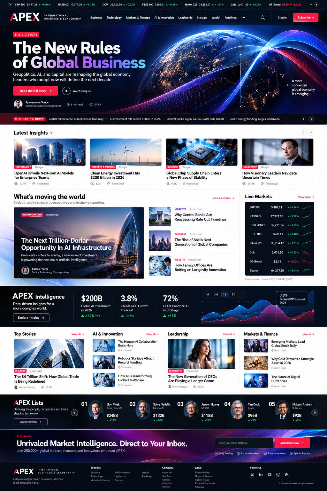

# APEX International Business & Leadership
# Antigravity Prompt — Premium News Homepage Redesign

## IMPORTANT

The current APEX homepage is functional but visually too traditional and newspaper/template-like.

Redesign the **public homepage** into a premium, modern, animated digital business-news platform.

The design direction should take inspiration from the *design principles* of modern Stripe: strong typography, generous composition, sophisticated gradients, layered visual storytelling, smooth motion, modular sections, interactive product-like components, strong whitespace, and polished transitions.

Reference:
https://stripe.com/

Do NOT copy Stripe's:
- logo
- brand colors
- exact layouts
- proprietary illustrations
- source code
- wording
- visual assets

APEX must remain an original business/news brand.

The goal is:

**Stripe-quality digital experience + premium international business journalism + APEX identity.**

---

# VISUAL REFERENCE

Use the attached image:

`apex_homepage_stripe_inspired_reference.png`

as the primary visual direction.



This is a design reference, not a pixel-perfect implementation.

Do not hard-code the example stories, people, prices, market values, dates, or metrics shown in the image.

Use real APEX database content.

---

# 1. DESIGN PHILOSOPHY

The current design should NOT be improved by simply changing colors.

Completely rethink the homepage composition.

Target feeling:

- premium
- intelligent
- cinematic
- modern
- editorial
- international
- technology-forward
- fast
- confident
- sophisticated

It should feel like a serious global business publication designed by a world-class product/design team.

Avoid making it look like:
- a traditional newspaper
- a basic WordPress news theme
- a Bootstrap template
- a generic magazine
- a dashboard
- an old-fashioned editorial portal

---

# 2. CORE VISUAL DIRECTION

Use:

- deep navy / near-black
- white
- warm neutrals
- APEX red as an accent
- electric blue
- violet
- subtle cyan
- sophisticated gradients

Do NOT use gradients everywhere.

Gradients should appear strategically in:
- hero artwork
- intelligence/insight sections
- CTA areas
- data visualization
- decorative background layers

Use a premium modern sans-serif for UI.

For editorial headlines, use a high-quality display/editorial typeface where appropriate.

Typography should be large and confident.

---

# 3. HEADER

Create a modern sticky header.

Desktop:

Top market ticker:
- S&P 500
- NASDAQ
- Dow
- FTSE
- Nikkei
- Gold
- Oil
- Bitcoin

Main navigation:

APEX logo

Business
Technology
Markets & Finance
AI & Innovation
Leadership
Startups
Wealth
Rankings

Right:
- Search
- Sign In
- Subscribe

Use a clean horizontal structure.

Do NOT make the header tall.

On scroll:
- header becomes slightly compact
- subtle background blur
- border appears
- navigation remains accessible

Mobile:
- logo
- search
- menu
- subscribe

---

# 4. HERO — MAJOR REDESIGN

The hero must be dramatically stronger than the current homepage.

Use a cinematic editorial hero.

Structure:

LEFT:
Small category label

Large headline

2–3 line summary

Author

Reading time

View count

CTA:
Read Full Story →

Secondary:
Watch Analysis

RIGHT:
Large cinematic image / visual

Add subtle animated visual layers.

Possible:
- moving gradient mesh
- slow parallax image
- animated light trails
- subtle particles
- animated data lines
- floating editorial metadata

Do NOT make animation distracting.

The hero should immediately communicate:

"Something important is happening in the world."

---

# 5. HERO MOTION

Implement premium motion.

On page load:

- headline fades/slides upward
- image gently scales from 1.03 to 1
- gradient layer moves slowly
- metadata appears sequentially
- CTA enters last

On hover:
- hero image has subtle zoom
- CTA arrow moves
- visual layers respond slightly

Use CSS transforms and lightweight JavaScript.

Avoid heavy animation libraries unless genuinely necessary.

Respect:

`prefers-reduced-motion`

---

# 6. BREAKING NEWS

Immediately below hero:

Full-width breaking-news ticker.

Example:

BREAKING
Global markets...
AI investment...
Central banks...
Energy markets...

The ticker should move horizontally.

Allow:
- pause on hover
- keyboard accessibility
- reduced-motion fallback

---

# 7. LATEST INSIGHTS

Create a horizontal editorial card rail.

Section:

Latest Insights →

4–5 cards.

Each card:

image
category
headline
author
reading time
views

Cards should animate subtly on hover.

Desktop:
horizontal grid

Mobile:
horizontal swipe rail

---

# 8. "WHAT'S MOVING THE WORLD"

Create the primary editorial content section.

Left:

Large feature story.

Right:

3–4 compact stories.

Feature card:

large image
category
large headline
description
author
reading time

Small stories:

thumbnail
category
headline
reading time

This section should feel editorially important without becoming cluttered.

---

# 9. LIVE MARKETS MODULE

Add a dark market intelligence panel.

Show real data when available:

S&P 500
NASDAQ
Dow Jones
FTSE
Nikkei
Gold
Oil
Bitcoin

Each:

symbol
value
percentage
tiny sparkline

Green/red should communicate movement but never be the only signal.

Add:

Live Markets →

If market data is not connected, do not fabricate numbers.

Show:

Market data unavailable

rather than fake values.

---

# 10. APEX INTELLIGENCE SECTION

Create a visually distinctive full-width dark section.

Headline:

APEX Intelligence

Subtitle:

Data-driven insights for a more complex world.

Include:

- major business metric
- market metric
- economic indicator
- AI/business statistic
- interactive chart

Example structure:

$200B
AI Investment

3.8%
Global GDP Growth

72%
CEOs Prioritizing AI

These are visual examples only.

Use real stored data where available.

Add an animated chart.

Chart should:
- draw on scroll
- support hover
- show tooltip
- animate subtly

---

# 11. CATEGORY ECOSYSTEM

Create modular category sections.

Sections:

AI & Innovation
Technology
Markets & Finance
Business
Leadership
Wealth
Startups

Each category should contain:

1 featured article
2–4 supporting stories
View all →

Do NOT make every section identical.

Create visual rhythm by alternating layouts.

---

# 12. EDITORIAL STORYTELLING

Use different editorial compositions:

- large feature
- split feature
- horizontal story list
- image + text
- dark section
- data section
- quote section
- ranking section

Avoid repeating the same 3-card grid everywhere.

---

# 13. APEX LISTS

Create a premium rankings module.

Dark background.

Title:

APEX Lists

Subtitle:

The people, companies and ideas shaping tomorrow.

Horizontal ranking cards.

Show:

01
Person/company
Category
Metric

02
Person/company
Category
Metric

etc.

Add:

View All Rankings →

Subtle horizontal movement.

---

# 14. TRENDING / MOST READ

Add a compact editorial ranking.

Title:

Most Read

01 Story
02 Story
03 Story
04 Story
05 Story

Display:
rank
category
headline
views
trend indicator

Use actual analytics data.

---

# 15. AUTHOR / EXPERT SPOTLIGHT

Create a premium expert section.

Show:

author portrait
name
role
short bio
latest article

Add:

View Profile →

Hover:
portrait subtly scales
card elevates

---

# 16. VIDEO / PODCAST

Create a multimedia section.

Tabs:

Video
Podcasts
Audio

Feature a large item with:
thumbnail
duration
headline
play button

Supporting episodes beside it.

Add subtle play animation.

---

# 17. NEWSLETTER CTA

Create a high-impact CTA section.

Use a dark/navy background with an animated gradient.

Headline:

Unrivaled Market Intelligence.
Direct to Your Inbox.

Subtitle:

Join business leaders, investors and innovators reading APEX.

Email input

Subscribe →

Add trust text.

Do not fabricate subscriber numbers.

---

# 18. FOOTER

Premium dark footer.

Columns:

APEX
About
Our Team
Careers
Contact

Sections
Business
Technology
Markets
AI
Leadership
Startups
Wealth

Lists
Billionaires
Companies
Rankings

Legal
Privacy
Terms
Cookie Policy
Editorial Standards

Follow:
X
LinkedIn
YouTube
Instagram
RSS

Include copyright.

---

# 19. ANIMATION SYSTEM

Use a coherent motion language.

Page load:
- fade-up
- staggered content entrance
- image reveal
- gradient movement

Scroll:
- reveal-on-scroll
- subtle parallax
- chart drawing
- number count-up where appropriate

Hover:
- image scale 1.02–1.05
- arrow movement
- subtle shadow/border
- underline animation

Navigation:
- dropdown fade/slide
- mega-menu transitions

Ticker:
- smooth marquee
- pause on hover

Do not animate everything.

Motion should communicate hierarchy.

---

# 20. STRIPE-INSPIRED INTERACTION PRINCIPLES

Use the following principles rather than copying Stripe:

### Principle 1 — Strong typography

Large headlines with clear hierarchy.

### Principle 2 — Visual depth

Use layers, gradients, images, data and subtle shadows.

### Principle 3 — Motion with purpose

Animations should explain relationships and transitions.

### Principle 4 — Modular storytelling

Build the page from distinct editorial modules.

### Principle 5 — Product-level polish

Every hover, transition, button and interaction should feel intentional.

### Principle 6 — Performance

Use CSS/SVG/lightweight JS where possible.

Stripe's current public site uses strong typographic hierarchy, modular sections, rich visual storytelling and interactive elements; use these as general design principles, not as a template to reproduce.

---

# 21. SEARCH

Create premium global search.

Search button:

Search APEX

Keyboard:

Ctrl + K

Search:
- articles
- authors
- topics
- categories
- rankings
- videos
- podcasts

Autocomplete should show:
icon
type
headline/name
category

---

# 22. MEGA MENU

Desktop navigation should support sophisticated mega menus.

Example:

Technology

Featured
Latest
AI
Semiconductors
Cloud
Cybersecurity
Enterprise Software

Include a featured story on the right.

Animate menu:
- fade
- slide
- slight blur

Do not make it enormous.

---

# 23. RESPONSIVE DESIGN

Desktop:
- 1440px+
- full editorial composition

Tablet:
- 768–1199px
- compressed grids
- horizontal content rails

Mobile:
- 375px+
- single column
- swipe rails
- sticky mobile header
- compact ticker
- simplified navigation

Never allow:
- horizontal page overflow
- clipped headlines
- broken images
- overlapping modules

---

# 24. PERFORMANCE

Do not turn the homepage into a heavy animation demo.

Requirements:

- lazy-load below-fold images
- use responsive image sizes
- WebP/AVIF where available
- preload hero image appropriately
- minimize JavaScript
- use CSS transforms
- use IntersectionObserver for reveal animations
- defer non-critical scripts
- avoid unnecessary animation libraries
- optimize SVGs
- prevent layout shift

Target:

Excellent Core Web Vitals.

---

# 25. ACCESSIBILITY

Implement:

- keyboard navigation
- visible focus
- semantic headings
- alt text
- accessible carousel controls
- pause controls for moving content
- `prefers-reduced-motion`
- sufficient color contrast
- accessible market data
- accessible buttons
- accessible mega menus

---

# 26. REAL DATA ONLY

The homepage must use actual database data.

Never hard-code:
- article counts
- market prices
- views
- subscriber counts
- authors
- rankings
- percentages
- dates

If data does not exist:

Show a proper empty state.

---

# 27. SEO

Preserve and improve:

- H1
- canonical
- title
- meta description
- Open Graph
- Twitter/X metadata
- Article JSON-LD
- Organization JSON-LD
- WebSite JSON-LD
- Breadcrumb schema where appropriate
- NewsArticle schema where appropriate

Homepage should have exactly one primary H1.

---

# 28. EXISTING APPLICATION SAFETY

Before changing anything:

Inspect:
- routes
- controllers
- Blade templates
- components
- models
- database
- existing homepage queries
- SEO
- analytics
- navigation

Do NOT:
- delete articles
- delete categories
- delete authors
- break URLs
- break article pages
- remove rankings
- remove search
- remove newsletters
- remove analytics
- remove Phase 1/2 functionality

This is a homepage redesign, not an application rebuild.

---

# 29. COMPONENT ARCHITECTURE

Create reusable components where appropriate:

- Header
- MarketTicker
- MegaMenu
- HeroStory
- BreakingTicker
- StoryCard
- StoryRail
- FeatureStory
- LiveMarkets
- IntelligencePanel
- CategorySection
- RankingStrip
- MostRead
- AuthorSpotlight
- MultimediaSection
- NewsletterCTA
- Footer

Avoid duplicating markup.

---

# 30. TESTING

Run:

```bash
cd C:\NewsBlog
php artisan test
php artisan route:list
npm run build
```

Verify:

- homepage
- article pages
- categories
- rankings
- search
- videos
- podcasts
- newsletter
- navigation
- mobile
- desktop

Test:

1920×1080
1600×900
1440×900
1280×800
1024×768
768×1024
390×844
375×812

---

# 31. FINAL VISUAL QA

Compare the new homepage against:

1. The current uploaded APEX homepage screenshot.
2. The attached APEX design reference.

The new version must feel dramatically more premium.

Specifically improve:

- hero
- typography
- visual hierarchy
- whitespace
- storytelling
- animation
- navigation
- imagery
- data visualization
- editorial modules
- responsive experience

Do not merely recolor the current page.

---

# 32. FINAL REPORT

Report:

1. Files changed
2. Components created
3. Routes changed
4. Queries/data sources changed
5. Animation system
6. Responsive improvements
7. Accessibility
8. Performance
9. SEO
10. Tests
11. Build results
12. Remaining issues

Final status:

`APEX HOMEPAGE REDESIGN COMPLETE`

or

`APEX HOMEPAGE REDESIGN COMPLETE — REMAINING ISSUES`

Do not claim completion if major visual or functional problems remain.

# FINAL DESIGN GOAL

Build a homepage that feels like:

**A world-class business intelligence product presented as a news publication.**

Not a newspaper template.

Not a generic blog.

Not a clone of Stripe.

Instead:

**APEX = premium business journalism + modern product design + intelligent motion + exceptional editorial storytelling.**
